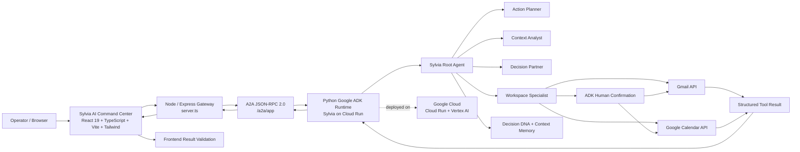

# Sylvia AI Architecture

Sylvia uses a two-part runtime: a React command center in this repository and an existing Python Google ADK agent runtime deployed on Google Cloud Run.

## System Diagram



## Components

### 1. React Command Center

The frontend provides the operator experience: conversation, Sylvia presence, Mission Control, Decision DNA/context views, Workspace panels, Activity Feed, approval cards, voice interaction, command palette, specialist status, and diagnostics.

### 2. Node/Express Gateway

`server.ts` provides the browser-facing same-origin boundary. It forwards A2A traffic to the deployed ADK service and keeps backend configuration outside the client UI.

### 3. A2A Transport

The frontend communicates with the ADK runtime using A2A JSON-RPC 2.0. The gateway forwards `/a2a/app` requests to the live Cloud Run service.

### 4. Google ADK Runtime

The Python service contains Sylvia's agent hierarchy and tool execution. The frontend does not replace or emulate this runtime.

### 5. Workspace Specialist

Workspace operations are executed against real Google APIs using backend credentials. Gmail and Calendar read operations return structured tool results that the frontend can ground in real data.

### 6. Human-in-the-Loop

Writes such as Gmail draft creation and Calendar event creation are gated by explicit ADK confirmation. A confirmation request is surfaced to the operator before the consequential tool call continues.

### 7. Result Validation

The frontend interprets structured ADK tool responses rather than relying on assistant prose. For Gmail drafts, a success state requires a successful structured result and a non-empty real `draft_id`. This prevents the UI from displaying a draft-created state merely because the model said it created one.

## Key Request Flows

### Live Gmail read

```text
Operator
  -> React UI
  -> Express gateway
  -> A2A message/send
  -> Sylvia / Workspace Specialist
  -> gmail_list_recent_messages
  -> Gmail API
  -> structured tool response
  -> A2A response
  -> React UI
```

### Gmail draft with approval

```text
Operator
  -> ask for draft
  -> Workspace Specialist
  -> gmail_create_draft_reply_with_approval
  -> ADK confirmation request
  -> HUMAN APPROVAL REQUIRED
  -> operator confirms
  -> confirmation response continues original task
  -> Gmail draft tool executes
  -> structured result {success, draft_created, draft_id, message_id, thread_id}
  -> frontend validates result
  -> Draft Created / Verified state
```

No email is sent by the draft action.

### Health and diagnostics

The frontend treats `/api/health` as a lightweight service-level probe. Detailed Workspace authentication and capability information comes from real backend Workspace/tool evidence rather than hard-coded UI assumptions.

## Trust Model

Sylvia follows this execution rule:

**Reason → coordinate → request approval → execute → verify → report truthfully.**

This separation is important because an AI-generated sentence is not equivalent to an external side effect. The UI therefore distinguishes between a proposal, an approval request, an executed tool result, and independently verified execution details.
