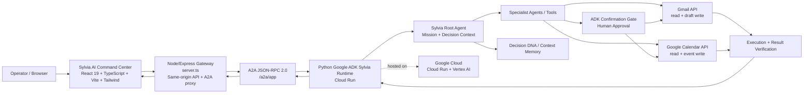

# Sylvia AI — Collaborative Digital Operator

Sylvia is an AI-powered collaborative digital operator built around a Google ADK agent system and a React web command center. Instead of acting as a simple chatbot, Sylvia coordinates specialized reasoning and action workflows across missions, decision context, memory, Google Workspace operations, and human approvals.

The repository contains the **web frontend and same-origin gateway**. The agent runtime remains the existing Python Google ADK service deployed on Google Cloud Run.

## What Sylvia Does

- **Collaborative missions** — turns broad goals into ordered, trackable action plans.
- **Decision DNA** — keeps goals, priorities, constraints, preferences, aversions, working style, and decision rules available to the agent system.
- **Specialist orchestration** — routes work through specialist capabilities such as planning and Google Workspace operations.
- **Live Gmail and Calendar** — reads real Google Workspace data through the production ADK tools instead of using seeded/demo inbox records.
- **Human-in-the-loop approvals** — consequential Gmail/Calendar writes stop for explicit operator confirmation before execution.
- **Truthful execution states** — the UI distinguishes preparation, approval required, successful execution, verification, and failure; a text-only AI claim is not treated as proof that a write occurred.
- **Diagnostics and telemetry** — exposes A2A activity, backend health, context IDs, latency, workspace evidence, and regression checks for the operator.
- **Voice and command-center UX** — combines chat, presence, specialist status, Mission Control, Memory/Decision DNA, Workspace panels, Activity Feed, and diagnostics in one interface.

## Architecture



See [ARCHITECTURE.md](ARCHITECTURE.md) for the component responsibilities and request flows.

## Production Backend

The frontend is connected to the live Sylvia ADK service:

`https://sylvia-agent-516232832461.africa-south1.run.app`

A2A requests are sent through:

`/a2a/app`

The browser normally communicates with the same-origin Node/Express gateway. Backend credentials stay server-side; OAuth tokens are never intended to be bundled into the browser application.

## Google Workspace Safety Model

Sylvia is designed so the UI does not invent Workspace state.

1. Gmail and Calendar panels begin empty until live backend evidence is received.
2. Workspace connection status is derived from the backend health/tool results rather than a UI-only toggle.
3. Read operations are grounded in actual Gmail/Calendar tool payloads.
4. A write operation enters **HUMAN APPROVAL REQUIRED** before the write is attempted.
5. After approval, the frontend evaluates the structured ADK tool result.
6. The UI only reports a Gmail draft as created when the backend returns a successful draft result containing a real draft identifier. It does not promote assistant prose into execution proof.

## Development

Install dependencies:

```bash
npm install
```

Run locally:

```bash
npm run dev
```

Type-check:

```bash
npm run lint
```

Build the production bundle:

```bash
npm run build
```

Start the compiled server:

```bash
npm start
```

The server respects the `PORT` environment variable for hosted environments.

## Backend Configuration

The default gateway targets the live Sylvia ADK Cloud Run service. To use another deployment, configure the backend URL through the project's supported environment variable instead of embedding credentials in frontend code.

Do **not** commit OAuth credentials, refresh tokens, service-account keys, or other secrets.

## Google AI Studio

This repository is structured so Google AI Studio can clone and run the frontend command center while preserving the existing Python Google ADK backend.

Recommended workflow after cloning:

```bash
npm install
npm run dev
```

Keep the existing `server.ts` gateway and the live ADK backend integration intact. The frontend is the operator console; the Python ADK service remains the agent runtime and Google Workspace execution layer.

## Project Structure

```text
Sylvia-Ai/
├─ src/                    # React UI, services, hooks, panels and components
├─ server.ts               # Node/Express gateway and A2A proxy
├─ ARCHITECTURE.md         # Architecture and runtime flows
├─ package.json            # Frontend/runtime dependencies and scripts
└─ README.md
```

## Why Sylvia

Most AI assistants stop at producing text. Sylvia is designed around the next step: **turning intent into coordinated work while keeping the operator in control of real-world actions**.

The core design principle is simple:

> **Reason → coordinate → request approval → execute → verify → report truthfully.**

## Hackathon Demo Focus

The strongest end-to-end demonstration is:

1. Ask Sylvia to inspect Gmail and identify messages that may require a reply.
2. Show that the returned records come from the live Gmail tools.
3. Ask Sylvia to prepare a reply draft.
4. Show the explicit human approval gate.
5. Approve the action.
6. Show the production ADK continuation and the structured Gmail draft result.
7. Show diagnostics proving the request crossed the A2A gateway to the Google Cloud-hosted backend.

## License

See the repository license and project files for the applicable terms.
